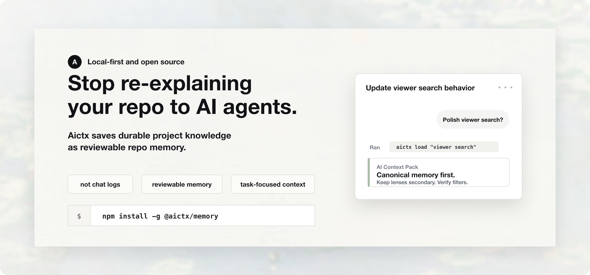
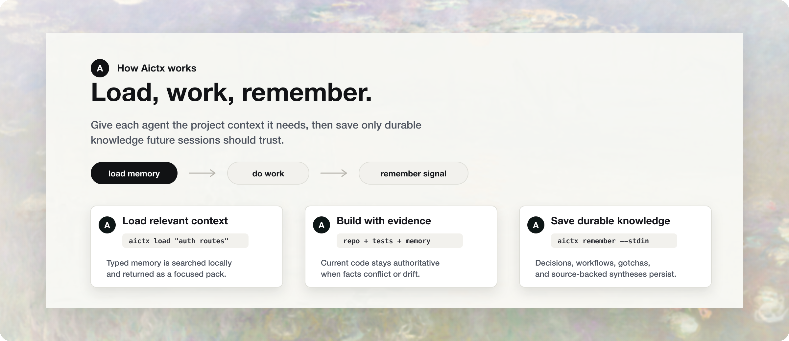
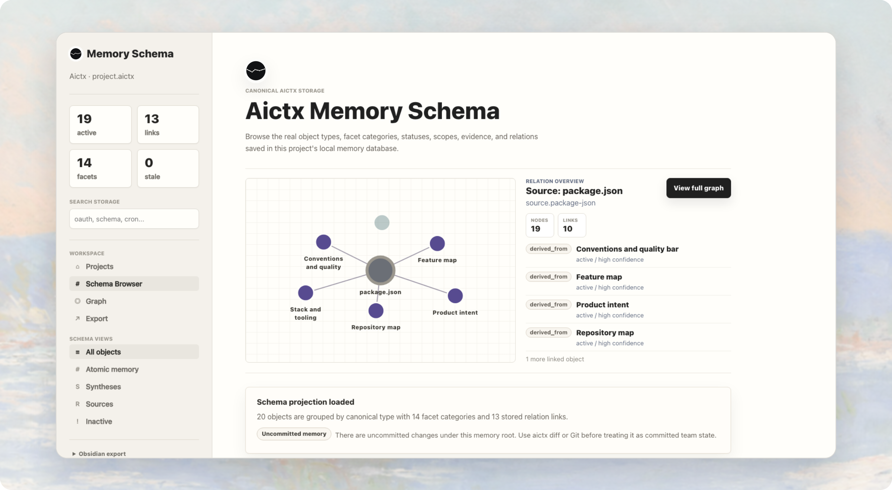

# Aictx



<p align="center">
  <a href="https://aictx.dev"></a>
  <a href="https://docs.aictx.dev"></a>
  <a href="https://demo.aictx.dev/?token=demo"></a>
</p>

<p align="center">
  <a href="https://github.com/aictx/memory/actions/workflows/ci.yml"></a>
  <a href="https://github.com/aictx/memory/actions/workflows/codeql.yml"></a>
  <a href="https://www.npmjs.com/package/@aictx/memory"></a>
  <a href="LICENSE"></a>
</p>

Aictx is local-first project memory for AI coding agents, inspired by
[Andrej Karpathy's LLM Wiki pattern](https://gist.githubusercontent.com/karpathy/442a6bf555914893e9891c11519de94f/raw/ac46de1ad27f92b28ac95459c782c07f6b8c964a/llm-wiki.md):
durable, human-editable project knowledge that models can read before work.

Stop re-explaining the same product intent, architecture decisions, repo
conventions, setup steps, and known traps every time a new AI coding session
starts. Activate Aictx once in a repo: it saves durable knowledge as local,
reviewable memory, wires short agent guidance into the project, and loads only
the pieces that matter for the current task.

Use it when you want:

- New agents to understand the repo without a long briefing.
- Durable decisions, workflows, gotchas, and source-backed summaries to survive
  across sessions, branches, and reviews.
- Local files and Git review instead of hosted memory, a vector database, or
  another prompt you have to manually keep current.

This repository publishes the npm package `@aictx/memory`. It is unrelated to
similarly named packages in other ecosystems.

## Get Started Quickly

Aictx requires Node.js `>=22`. Core commands run locally; no cloud account,
model API, embeddings, or hosted sync are required.

```bash
npm install -g @aictx/memory
cd path/to/your/repo
aictx setup
aictx load "onboard to this repository"
aictx view
```

`aictx setup` activates Aictx in the current repo. It creates local `.aictx/`
memory, updates the marked Aictx sections in `AGENTS.md` and `CLAUDE.md`, writes
conservative first-run memory, runs checks, and starts the local viewer. Use
`aictx setup --no-view` when you do not want the viewer to start, or
`aictx setup --dry-run` to preview before writing.

Aictx writes local files and never commits automatically.

## Ask an Agent to Activate It

Paste this into Codex, Claude Code, OpenCode, Cursor, Cline, or another
CLI-capable coding agent from the project root:

```text
Set up Aictx memory for this repository.

Run:
npm install -g @aictx/memory
aictx setup
aictx check
aictx load "onboard to this repository"

When this is done, report:
- whether setup wrote memory
- whether check passed
- how I can inspect the result with `aictx view` or `aictx diff`
```

After setup, the normal agent loop is small:

```bash
aictx load "<task summary>"
# do the work
aictx remember --stdin
aictx diff
```

Save only durable project knowledge. Aictx is meant to reduce repeated context
work, not archive every task transcript.

## What Activates

Four surfaces ship today. Each one works locally and fits normal Git review.

| Surface | What it gives agents and humans | Try |
| --- | --- | --- |
| One-time setup | Creates local memory and short repo guidance so future agents know when to load and save context. | `aictx setup` |
| Task-focused loading | Pulls relevant project memory before coding, debugging, review, architecture, or onboarding work. | `aictx load "change auth routes"` |
| Visual memory viewer | Opens a local browser for memory objects, facets, role coverage, provenance, and graph context. | `aictx view` |
| Save discipline | Saves only durable facts, decisions, workflows, gotchas, source records, and syntheses. | `aictx remember --stdin` |

## Works With Your Agent

| Agent or client | Fastest path |
| --- | --- |
| Codex | `aictx setup` writes `AGENTS.md`; use the CLI loop by default. |
| Claude Code | `aictx setup` writes `CLAUDE.md`; use the CLI loop by default. |
| OpenCode | Uses the root `AGENTS.md` guidance created by setup. |
| Cursor | Copy `integrations/cursor/aictx.mdc` into `.cursor/rules/aictx.mdc`, then run setup. |
| Cline | Copy `integrations/cline/aictx.md` into `.clinerules/aictx.md`, then run setup. |
| MCP-capable clients | Start with the CLI; configure `aictx-mcp` later when the client exposes MCP tools. |

## How it works



```text
set up once -> agents load relevant reminders -> save durable discoveries
```

The loop is deliberately small after setup. Agents load memory before
non-trivial work, use the current repo and tests as evidence, then save only
knowledge that should survive future sessions, branches, and reviews.

## What gets stored

| Memory | Use it for |
| --- | --- |
| `decision` / `constraint` | Choices and boundaries future agents should respect. |
| `workflow` / `gotcha` | Repeatable procedures and known traps. |
| `source` | Where important project facts came from. |
| `synthesis` | Compact summaries of product intent, architecture, feature maps, conventions, and agent guidance. |
| `question` / `fact` / `concept` | Open scope, reusable facts, and domain ideas. |

Aictx does not require a cloud account, embeddings, hosted sync, an external
model API, or network access for core memory commands. Saved memory is active
immediately after Aictx validates and writes it.

## Why Aictx?

Aictx is for durable project context that should survive between agents,
sessions, branches, and reviews without making you re-teach the repo each time.

- Why not `AGENTS.md` only? Agent instruction files are good operating manuals,
  but they become too broad and static when they also try to hold product
  intent, decisions, gotchas, workflows, and source-backed summaries.
- Why not a vector DB or RAG stack? Those are useful for large retrieval
  systems. Aictx keeps v1 project memory local, inspectable, Git-aware, and
  usable without embeddings, hosted infrastructure, or a model API.
- Why not long context? Long context helps inside one session. It does not make
  memory reviewable, current, reusable across future sessions, or easy to clean
  up when facts go stale.
- Why local files? Plain files are reviewable and portable. Aictx builds on that
  foundation with validation, typed memory, a local index, task-focused loading,
  relation-aware inspection, and a save/no-save discipline.

## Go Deeper

The README is the fast activation path. Setup details, agent recipes, CLI
reference, MCP, and wiki workflows live in the core docs:
[docs.aictx.dev](https://docs.aictx.dev/).

## Install

Aictx requires Node.js `>=22`.

Install globally for the simplest CLI and MCP setup:

```bash
npm install -g @aictx/memory
```

Global install is the recommended default for regular CLI use and optional MCP
use. You do not need to add Aictx to each project's `package.json` unless that
project should pin its own Aictx version.

For project-local version pinning:

```bash
pnpm add -D @aictx/memory
npm install -D @aictx/memory
```

If `aictx` is not on `PATH`, run commands through the package manager or local
binary:

```bash
pnpm exec aictx init
npm exec aictx init
./node_modules/.bin/aictx init
npx --package @aictx/memory -- aictx init
```

For MCP fallbacks:

```bash
pnpm exec aictx-mcp
npm exec aictx-mcp
./node_modules/.bin/aictx-mcp
npx --package @aictx/memory -- aictx-mcp
```

Package-manager and local-binary fallbacks are version-sensitive. If a local
install is stale, update it or use a current global/source binary before
trusting schema errors.

## Core commands

The first-run path above is intentionally short. These are the commands you will
use day to day.

Set up useful first-run memory inside an existing project:

```bash
aictx setup
```

`setup` starts the local viewer after writing memory so humans can
inspect the result immediately. Use `aictx setup --no-view` to skip viewer
startup in scripts or agent runs.

Preview the conservative bootstrap patch without writing or initializing
storage:

```bash
aictx setup --dry-run
```

`aictx setup --force --dry-run` previews reset/setup behavior without deleting
or rewriting anything.

`aictx init` is the lower-level empty-storage initializer for automation,
tests, or manual workflows. Its next step is normally `aictx setup`.

Load relevant memory before non-trivial work:

```bash
aictx load "change auth routes"
```

Save durable memory after meaningful work:

```bash
aictx remember --stdin
```

File source-backed wiki-style memory when an agent has already read and
synthesized a source:

```bash
aictx wiki ingest --stdin
aictx wiki file --stdin
aictx wiki lint
aictx wiki log
```

The wiki commands do not fetch URLs, call a model, or infer semantics. They
write structured memory supplied by the agent, with source records carrying
explicit raw-source `origin` metadata.

Inspect memory asynchronously when needed:

```bash
aictx view
aictx diff
```

## Visual memory

`aictx view` opens a local viewer for inspecting project memory, source-backed
records, role coverage, and graph relationships without leaving the repo.



## Mental model

`.aictx/` contains canonical memory and generated support files.

Canonical memory is the durable source of truth. It includes human-readable
Markdown bodies, JSON sidecars with structured metadata, relation JSON files,
and `events.jsonl` for semantic memory history. Generated state is rebuildable:
the SQLite search index, context packs, and exports can be regenerated from
canonical memory.

Aictx storage uses a v4 hybrid memory model:

- `source` records preserve where context came from. Their optional `origin`
  block identifies the raw source, such as a file path, URL, digest, capture
  timestamp, and media type. The object `source` field still means who wrote
  the memory change.
- Atomic memories capture precise reusable claims as `decision`, `constraint`,
  `question`, `fact`, `gotcha`, `workflow`, `note`, or `concept` objects.
- `synthesis` records maintain compact summaries for product intent, feature
  maps, roadmap, architecture, conventions, agent guidance, and repeated
  workflows or how-to collections.

Setup, lenses, viewer, and audit use a built-in soft role catalog for readable
coverage: product intent, capability map, repository map, architecture and
patterns, stack/tooling, conventions/quality, workflows/how-tos, verification,
gotchas/risks, open questions, sources/provenance, agent guidance, and optional
branch handoff. Missing or thin project-truth roles are reported as generated
gaps, not as required placeholder files. Missing optional branch handoff is
counted in coverage without producing a gap.

```text
setup creates/repairs memory roles
load gives task-focused context
lens shows readable project views
remember saves durable discoveries
handoff preserves unfinished branch state
```

`aictx audit` includes role coverage gaps after normal audit findings, but
missing roles are warnings/gaps only; `aictx check` does not fail because a role
is empty. `aictx handoff show` shows only an active current-branch handoff;
closed handoffs remain historical memory for `aictx inspect`, `aictx view`, and
Git history.

Object types are `project`, `architecture`, `source`, `synthesis`, `decision`,
`constraint`, `question`, `fact`, `gotcha`, `workflow`, `note`, and `concept`.
Do not create `history`, `task-note`, or `feature` object types.

Load modes are `coding`, `debugging`, `review`, `architecture`, and
`onboarding`. Modes tune deterministic ranking and rendering only; they do not
broaden the project scope, call a model, use external retrieval, or load the
whole project.

## CLI and MCP boundary

The CLI is the default path for routine memory work. MCP remains a supported
integration path when the agent client has already launched and connected to
`aictx-mcp`.

MCP exposes exactly `load_memory`, `search_memory`, `inspect_memory`,
`remember_memory`, `save_memory_patch`, and `diff_memory` in v1.

Local MCP is the near-term integration path for MCP-capable local agent
harnesses. Remote MCP, hosted sync, cloud hosting, OAuth or cloud auth,
tenancy, billing, and ChatGPT App SDK UI remain future work. Future
ChatGPT-compatible `search`/`fetch` names are adapter aliases over Aictx
search/inspect behavior, not local MCP tool names.

Setup, lenses, handoff, maintenance, recovery, export, registry, viewer, docs,
suggest, audit, wiki, and stale workflows remain outside local MCP. Graph inspection
is available in the CLI and local viewer, but remains outside local MCP.
Non-MCP capabilities are not MCP parity gaps. Do not add or ask for MCP tools
solely to mirror these surfaces, and do not edit `.aictx/` files directly when
a supported MCP tool or CLI command exists.

| Capability | MCP | CLI |
| --- | --- | --- |
| Load task context | `load_memory` | `aictx load` |
| Search memory | `search_memory` | `aictx search` |
| Inspect memory | `inspect_memory` | `aictx inspect` |
| Remember durable context | `remember_memory` | `aictx remember` |
| Save structured patch | `save_memory_patch` | `aictx save` |
| Show memory diff | `diff_memory` | `aictx diff` |
| Initialize storage | none | `aictx init`, `aictx setup` |
| Maintain storage | none | `aictx check`, `aictx rebuild`, `aictx reset`, `aictx upgrade` |
| Recover memory history | none | `aictx history`, `aictx restore`, `aictx rewind` |
| Review patch files | none | `aictx patch review` |
| Inspect stale memory and graph neighborhoods | none | `aictx stale`, `aictx graph`, `aictx view` graph screen |
| Show readable memory views | none | `aictx lens` |
| Manage branch handoff | none | `aictx handoff` |
| Export projections | none | `aictx export obsidian` |
| Manage project registry | none | `aictx projects` |
| View local memory | none | `aictx view` |
| Read public docs | none | `aictx docs` |
| Suggest or audit memory | none | `aictx suggest`, `aictx audit` |
| Wiki source workflow | none | `aictx wiki` |

`aictx view [--port <number>] [--open] [--detach] [--json]` starts the local
memory viewer. `aictx view` is CLI-only in v1.

## Agent memory discipline

Agents should:

- Load narrowly before non-trivial work.
- Save only durable knowledge directly as active memory.
- Update existing memory before creating duplicates.
- Stale or supersede wrong old memory when current evidence invalidates it.
- Delete memory that should not persist.
- Prefer current code and user requests over loaded memory when they conflict.
- Report whether memory changed; inspection can happen asynchronously through
  the viewer, `aictx diff`, or Git tools.
- Save nothing when the task produced no durable future value.

Right-size memory. Use atomic memories for precise reusable claims,
`synthesis` memories for compact area-level understanding, and `source`
memories to preserve where context came from. Create relations only when the
connection matters, using predicates such as `derived_from`, `summarizes`,
`documents`, `supports`, `challenges`, `requires`, `depends_on`, `affects`, or
`supersedes`.

Use `update_object`, `mark_stale`, `supersede_object`, `delete_object`, and
`create_relation` when they fit better than creating another object. Use
`gotcha` for known failure modes and traps. Use `workflow` for repeated
project-specific how-tos: procedures, runbooks, command sequences,
release/debugging/migration paths, verification routines, and maintenance
steps. Generic tutorials, one-off task notes, and task diaries should not become
workflow memory.

Dirty or untracked `.aictx/` files are not by themselves a reason to skip saving
durable memory. Dirty state is not a preflight blocker. Aictx backs up dirty
touched files under `.aictx/recovery/` before overwrite/delete and continues
where possible.

## Development

```bash
pnpm install
pnpm build
pnpm typecheck
pnpm test
pnpm test:local
pnpm build:docs
```

The package provides two binaries:

- `aictx`: the command-line interface
- `aictx-mcp`: the MCP stdio server for AI coding clients

For contribution workflow, branch protection, and AI-agent git instructions,
see [CONTRIBUTING.md](CONTRIBUTING.md). The short version is: work on a feature
branch, open a pull request to `main`, wait for required checks, then merge the
pull request instead of pushing directly to `main`.

## Project health

- Contributing guide: [CONTRIBUTING.md](CONTRIBUTING.md)
- Code of conduct: [CODE_OF_CONDUCT.md](CODE_OF_CONDUCT.md)
- Security policy: [SECURITY.md](SECURITY.md)
- Support paths: [SUPPORT.md](SUPPORT.md)
- Public roadmap: [ROADMAP.md](ROADMAP.md)
- Release policy: [RELEASE.md](RELEASE.md)
- Changelog: [CHANGELOG.md](CHANGELOG.md)

Public releases should have matching `vX.Y.Z` Git tags and npm provenance.
The default branch is protected and requires pull requests plus CI/security
checks before merge.
